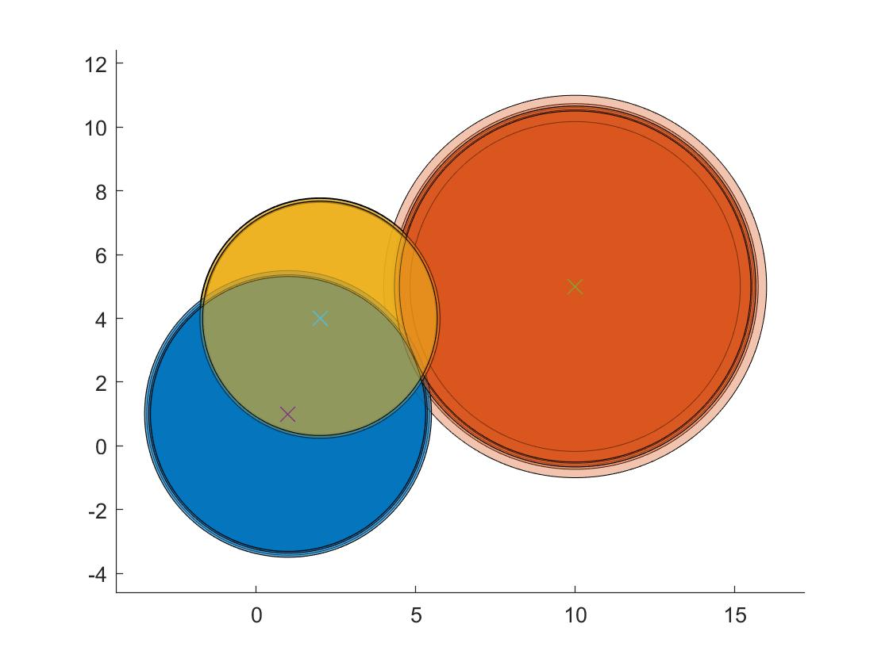
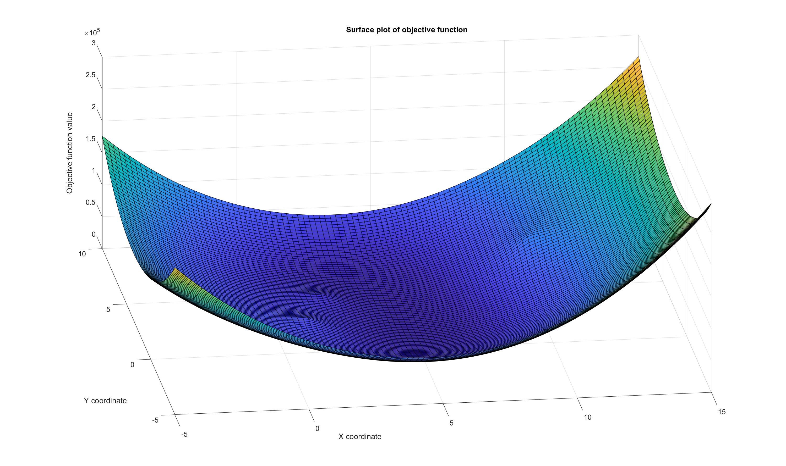
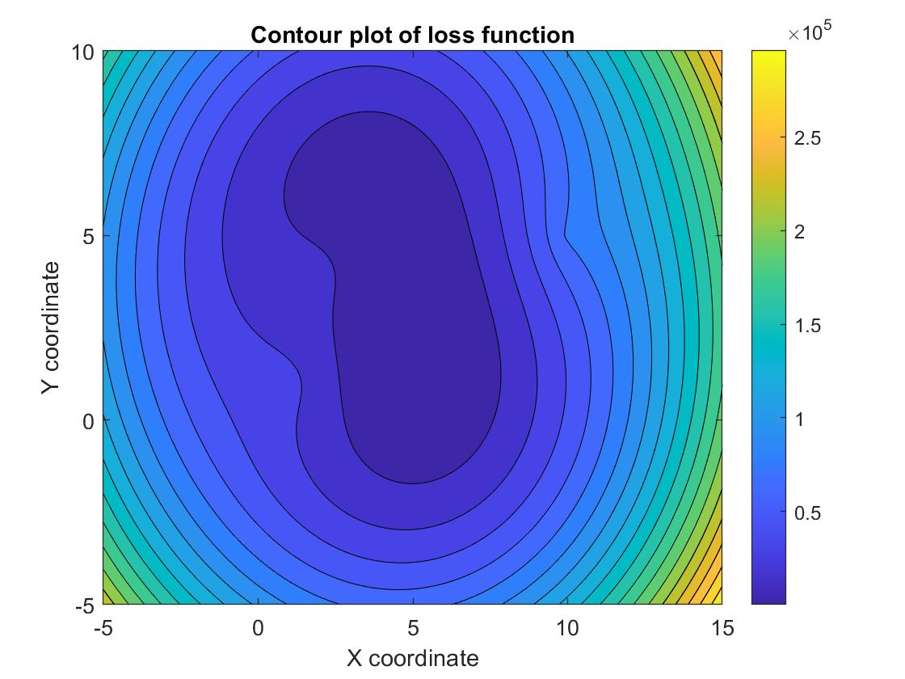

# FindLostPhone Project

## Overview
This project aims to locate a lost phone using the data from three different stations. Each station provides distance information to the phone, but they are subjected to various types of noise. 

#### Representation of the Task Problem

## Methodology
We employ the Levenberg-Marquardt algorithm, a nonlinear local optimization technique, to accurately estimate the phone's position despite the noise in the data.

### Visualization of Loss Function
The following images illustrate aspects of the loss function used in our optimization process:

#### 3D Plot of Loss Function

#### Contour Plot of Loss Function

We have also implemented the weighted non linear least squares and obtained superior results.

## Repository Contents
- MATLAB code implementing the Levenberg-Marquardt algorithm.
- [FindLostPhone Methodology (PDF)](FindLostPhone.pdf): A detailed document explaining the theoretical background and implementation details.
